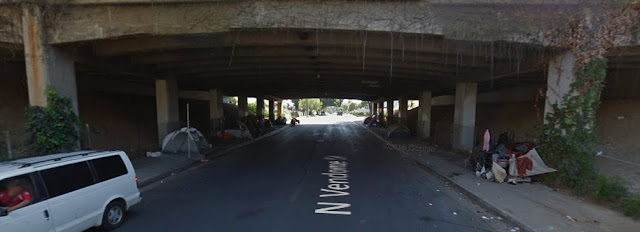

Underpass
=========



Bootstrap configuration for a small(ish) cluster of Vault and Nomad instances

## Vault

Build a Vault raft-cluster using [vault-yubikey-helper](https://github.com/jmanero/vault-yubikey-helper/tree/master) to generate listener certificates and encrypt unseal/root-token secrets

```
## Download and unpack dependencies
make

## Install and configure Vault on a server
./scripts/install-vault --init some-server-address
```

This should result in a single unsealed vault node with a root-privileged token at `/root/.vault-token`
